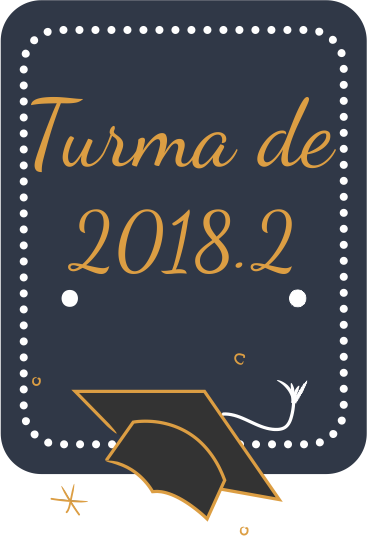

<link href="https://fonts.googleapis.com/css?family=Dancing+Script&display=swap" rel="stylesheet">

 

<h1 style="font-family:'Dancing Script', cursive; color:#38425B;"><strong>Formandos Pólo de Macaúbas</strong></h1>

<h2><strong>Colação de Grau: 12 de junho de 2019 às 18h</strong></h2>

 Requerente – Allany Marques Trindade 

 Juramentista – Nilmárcia Souza Oliveira Lima

 Oradoras –   Ana Lourdes Moreno Rodrigues Silva | Daiana Móia Meira 
 

<h2><strong></strong></h2>

<h2><strong></strong></h2>

 

