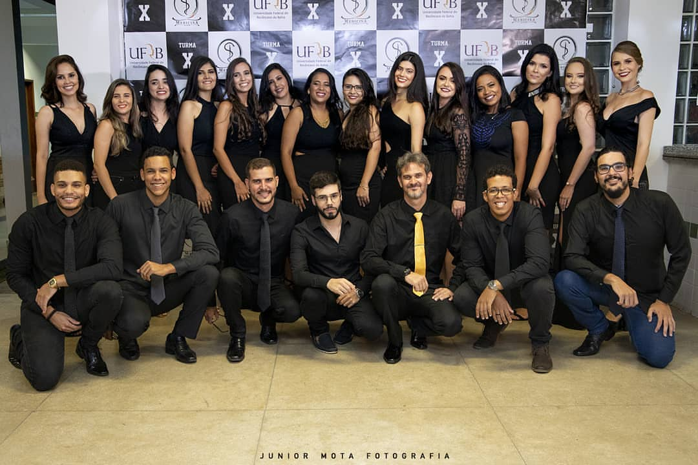

<link href="https://fonts.googleapis.com/css?family=Dancing+Script&display=swap" rel="stylesheet">

 

<h1 style="font-family:'Dancing Script', cursive; color:#38425B;"><strong>Formandos Pólo Rio Real</strong></h1>

 

<h2><strong>ALESSANDRA VAZ FIGUEIREDO</strong></h2>

<h2><strong>ALLANY MARQUES TRINDADE</strong></h2>

 

